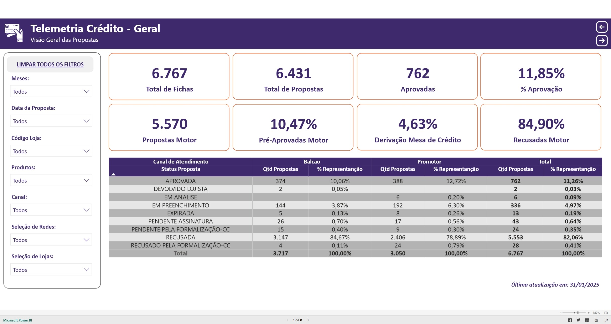

# Documentação Técnica - Pipeline ETL & Telemetria e Análise de Risco na Esteira de Crédito


> **Projeto de Portfólio:** desenvolvido com base em um contexto corporativo real. Dados, nomes de tabelas, colunas, parceiros e métricas sensíveis foram **fictícios/adaptados** para garantir a confidencialidade das informações.

---

## Sumário

1. [Visão Geral](#1-visão-geral)
2. [O Desafio de Negócio](#2-o-desafio-de-negócio)
3. [Arquitetura da Solução & Fluxo dos Dados](#3-arquitetura-da-solução--fluxo-dos-dados)
4. [Stack Tecnológica](#4-stack-tecnológica)
5. [Orquestração e Automação da Carga](#5-orquestração-e-automação-da-carga)
6. [Dicionário de Dados (Resumido)](#6-dicionário-de-dados-resumido)
7. [Recursos e Funcionalidades do Dashboard](#7-recursos-e-funcionalidades-do-dashboard)
8. [Obstáculos Técnicos e Soluções](#8-obstáculos-técnicos-e-soluções)
9. [Galeria do Projeto](#9-galeria-do-projeto)
10. [Como Executar](#10-como-executar)
11. [Impacto e Resultados](#11-impacto-e-resultados)

---

## 1. Visão Geral

Centralização e análise end-to-end da esteira de originação de crédito (cartão co-branded / private label). O projeto abrange desde a ingestão diária via pipeline Python/SQL até o consumo por um modelo semântico no Power BI, dando visibilidade total sobre a taxa de conversão das propostas, a eficácia das políticas do motor de decisão e a exposição financeira por perfil socioeconômico.

## 2. O Desafio de Negócio

A operação de crédito recebia propostas vindas de múltiplos canais (*autoatendimento, balcão de lojas, promotoras de venda*). As etapas de análise — *pré-aprovação automática, mesa de crédito, checagem de fraude e consulta a bureaus externos* — ficavam espalhadas em sistemas diferentes.

**Desafios identificados na operação:**

- **Esteira fragmentada** — ausência de uma visão unificada do funil de conversão.
- **Motivos de recusa não padronizados** — centenas de *strings* de recusa divergentes retornadas pelo motor de decisão, sem agrupamento de negócio.
- **Exposição de risco sem visibilidade** — falta de acompanhamento consolidado do limite médio concedido por perfil socioeconômico.

## 3. Arquitetura da Solução & Fluxo dos Dados

```text
Sistema do Emissor (SQL Server)
        │
        ▼ (Extração incremental)
Pipeline Python / SQL (ETL, sanitização e regras de negócio)
        │
        ▼ (Carga idempotente — Delete + Insert)
Data Warehouse PostgreSQL (staging e analytics)
        │
        ▼ (Conexão via Gateway on-premises)
Power BI Dataflow (fluxo de dados)
        │
        ▼ (Modelo semântico & medidas DAX)
Dashboard de Telemetria (Power BI Service)
```

## 4. Stack Tecnológica

| Camada | Tecnologia |
|---|---|
| Ingestão & ETL | Python (pandas, SQLAlchemy) e SQL |
| Banco de origem | SQL Server (via pyodbc) |
| Data Warehouse | PostgreSQL (staging e analytics) |
| Orquestração local | Script `.bat` + Agendador de Tarefas do Windows (Task Scheduler) |
| Camada semântica & ingestão BI | Power BI Dataflow, via On-Premises Data Gateway |
| Modelagem & métricas | Power BI Desktop (DAX, tabela analítica agregada) |

## 5. Orquestração e Automação da Carga

A automação foi desenhada para garantir a saúde dos dados e resiliência no pipeline:

1. **Agendador de Tarefas do Windows** aciona periodicamente (ex: a cada 1 hora) o script `executar_pipeline.bat`.
2. **Verificação de saúde (`.bat`)** — o script checa se o log de sucesso do dia já foi gerado:
   - Se o log existe, entende que a carga da janela já ocorreu e encerra a execução.
   - Se o log não existe, executa `pipeline_telemetria_credito.py`.
3. **Execução Python** — realiza a extração incremental do período, aplica as regras de classificação de perfil socioeconômico e executa o *Delete + Insert* nas tabelas `staging` e `analytics` do PostgreSQL. Ao finalizar sem erros, gera o arquivo de log de sucesso.
4. **Atualização no Power BI Service** — configurada via Data Gateway para ler a tabela analítica do PostgreSQL de forma agendada a cada 1 hora, refletindo os dados mais recentes nos painéis sem necessidade de intervenção manual.

## 6. Dicionário de Dados (Resumido)

### `originacao.proposta_credito` (origem — SQL Server)

| Coluna | Descrição |
|---|---|
| `proposta_id` | Identificador único da proposta |
| `id_lojista` | Identificador do ponto de venda |
| `id_agente_originador` | Identificador do parceiro/agente originador |
| `data_emissao` | Data de criação da proposta |
| `limite_credito_aprovado` | Limite de crédito atribuído ao cliente |

### `staging.fato_propostas_credito` (Data Warehouse)

Réplica higienizada da extração, na granularidade de proposta individual.

### `analytics.fato_propostas_credito_diario` (Data Warehouse)

Tabela agregada por dia/status/canal/perfil, contendo a métrica `quantidade_propostas`. É a tabela consumida diretamente pelo Power BI.

## 7. Recursos e Funcionalidades do Dashboard

O painel foi estruturado em módulos interativos para atender aos times de Risco de Crédito, Produtos e Prevenção à Fraude:

- **Visão geral da esteira** — total de fichas submetidas, propostas criadas, aprovadas e taxa de aprovação consolidada.
- **Indicadores do motor de crédito** — percentual de pré-aprovados, derivação para mesa de crédito e reprovações diretas.
- **Acompanhamento temporal** — evolução diária e comparativo mensal de propostas vs. taxa de aprovação.
- **Análise de motivos de recusa** — ranking e agrupamento padronizado de recusas (restrição em bureau, score, dados divergentes, renda incompatível).
- **Perfil socioeconômico** — distribuição de propostas e taxa de aprovação cruzadas por classe profissional e faixa de renda (em salários mínimos).
- **Gestão de limites de crédito** — exposição total, limite médio concedido e curvas de limite por perfil de cliente.

## 8. Obstáculos Técnicos e Soluções

- **Normalização de recusas** — transformação de centenas de códigos dispersos em blocos lógicos de negócio, feita no ETL em Python.
- **Funil sem distorção** — medidas em DAX capazes de isolar cadastros abandonados ou expirados do cálculo da taxa real de aprovação do motor.
- **Alta performance no BI** — como a higienização, agregação e categorização socioeconômica são feitas previamente pelo Python na carga do PostgreSQL, o Power BI consome uma camada já refinada, dispensando tratamentos pesados no Power Query.

## 9. Galeria do Projeto



🔗 **[Acessar demonstração interativa no Portfólio](SEU_LINK_AQUI)**

## 10. Como Executar

### Variáveis de ambiente necessárias

```
SOURCE_DB_HOST=
SOURCE_DB_PORT=1433
SOURCE_DB_NAME=
SOURCE_DB_USER=
SOURCE_DB_PASSWORD=

WAREHOUSE_DB_HOST=
WAREHOUSE_DB_PORT=5432
WAREHOUSE_DB_NAME=
WAREHOUSE_DB_USER=
WAREHOUSE_DB_PASSWORD=
```

### Dependências

```bash
pip install pandas sqlalchemy psycopg2-binary pyodbc python-dotenv
```

### Execução

```bash
python pipeline_telemetria_credito.py
```

## 11. Impacto e Resultados

- **Ferramenta central de risco** — painel unificado adotado estrategicamente pelas equipes de Risco, Prevenção e Produtos.
- **Recalibração de políticas** — subsídio de dados para ajuste fino de notas de corte do motor de decisão e limites por perfil.
- **Otimização de canais** — mapeamento claro dos canais de vendas com maior taxa de conversão e menor risco financeiro.
